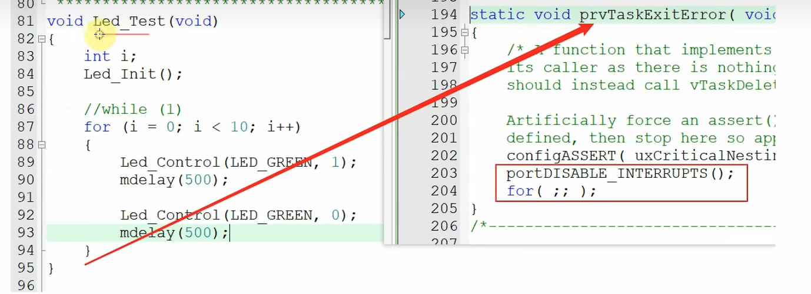
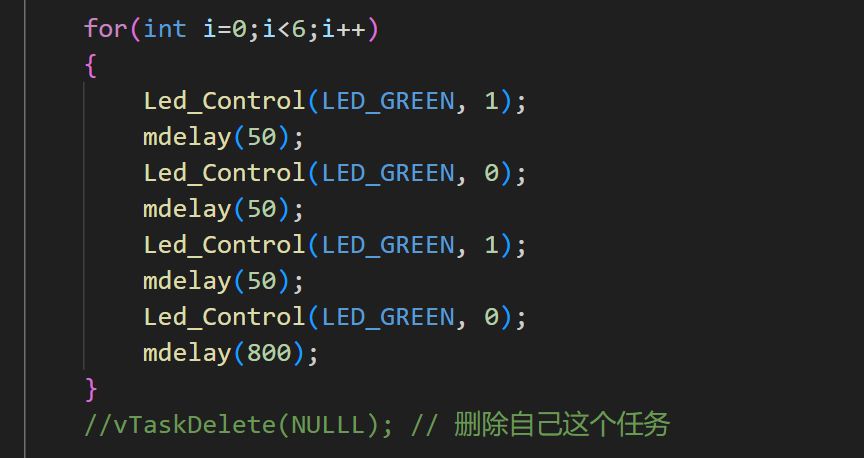
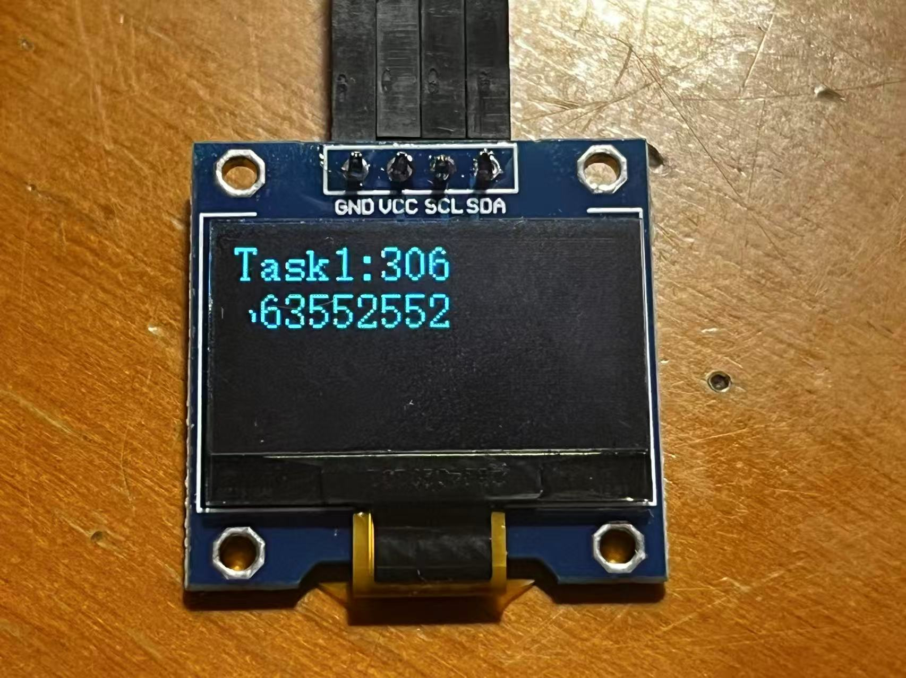
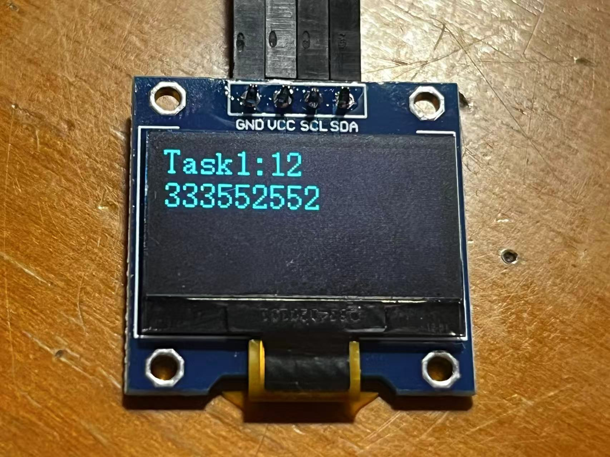

# chapter1-FreeRTOS 多任务与栈溢出检测

## 1. 任务创建与栈分配

本工程共创建了五个任务：

```cpp
struct PrintTask
{
  uint32_t x;
  uint32_t y;
  char name[16];
};
static struct PrintTask task1 = {0,0,"Task1"};
static struct PrintTask task2 = {0,2,"Task2"};
static struct PrintTask task3 = {0,4,"Task3"};
static struct PrintTask task4 = {0,6,"Task4"};
int OLEDeable = 1;

void PrintTask(void *parameters)
{
  struct PrintTask* taskinfo = parameters;
  uint32_t cnt = 0;
  uint16_t len;
  while(1)
  {
    if(OLEDeable)
    {
      OLEDeable = 0;
      char buf[16];
      len = LCD_PrintString(taskinfo->x, taskinfo->y, taskinfo->name);
      len += LCD_PrintString(len, taskinfo->y, ":");                
      LCD_PrintSignedVal(len, taskinfo->y, cnt++);
      OLEDeable = 1;
    }
    osDelay(5);
  }
}
```

- `task1` ~ `task4`：共用 `PrintTask()` 函数进行屏幕打印。
- `Default` 任务：默认 stack 大小为 `128 * 4`。
- 用户自定义的四个任务，每个 stack 大小为 `128`。

### 任务创建

```cpp
osThreadId_t defaultTaskHandle;
const osThreadAttr_t defaultTask_attributes = {
  .name = "defaultTask",
  .stack_size = 128,
  .priority = (osPriority_t) osPriorityNormal,
};

defaultTaskHandle = osThreadNew(StartDefaultTask, NULL, &defaultTask_attributes);

xTaskCreate(PrintTask, "PrintTask1", 128, &task1, osPriorityNormal, NULL);
xTaskCreate(PrintTask, "PrintTask2", 128, &task2, osPriorityNormal, NULL);
xTaskCreate(PrintTask, "PrintTask3", 128, &task3, osPriorityNormal, NULL);
xTaskCreate(PrintTask, "PrintTask4", 128, &task4, osPriorityNormal, NULL);
```

> **总共分配的栈空间**：
> 
> 128*4（Default） + 128 + 128 + 128 + 128 = 1024 word = 4096 字节 ≈ 4KB

- 若五个任务有一个无法运行，将某任务的栈空间减小时可正常运行，推测 RAM 空间不足。

## 2. FreeRTOS 栈溢出检测方法

为防止任务栈溢出导致系统异常，建议开启 FreeRTOS 的栈溢出检测功能。

### 1. 打开栈溢出检测

在 `FreeRTOSConfig.h` 文件中，添加或修改如下宏定义：

```cpp
#define configCHECK_FOR_STACK_OVERFLOW 2  // 推荐用2，检测更严格
```

### 2. 实现栈溢出钩子函数

在工程代码（如 `freertos.c` 或 `main.c`）中添加如下函数：

```c
void vApplicationStackOverflowHook(TaskHandle_t xTask, char *pcTaskName)
{
    // 可打断点、点灯、打印等
    printf("Stack overflow in task: %s\r\n", pcTaskName);
    while(1); // 死循环，便于调试
}
```

#### 说明

- 当任务发生栈溢出时，程序会进入 `vApplicationStackOverflowHook`，可通过串口、LED 或调试器发现问题。
- `configCHECK_FOR_STACK_OVERFLOW` 设为 2 检查更严格。
- 若用 printf，确保不会再导致栈溢出（可用 LED 或断点简单测试）。

#### 提问题
- 如何互斥访问 OLED？
- 为什么最后创建的 task4 反而最先运行？（实验现象如此）
>回答： freeRTOS初始化时创建任务按照顺序进行，currentTCB链表会依次被从task1赋值到taskn，因此最后一个创建的任务此时证拿到的是currentTCB链表。Tick中断在每一个时钟周期之后都会按照从高到低的优先级遍历一次readyedtasklist链表，当检测到第一个的task时进行运行，因此最后一个平行优先级任务时第一个开始被执行的。

# chapter2-FreeRTOS 任务管理与调度

## 1. 任务优先级和 Tick

### 1.1 任务优先级

- 优先级取值范围：0 ~ (configMAX_PRIORITIES – 1)，数值越大优先级越高。
- FreeRTOS 调度器确保最高优先级的可运行任务立即执行。最高优先级的任务没有运行完之前低优先级任务一直无法运行。
- 对于相同优先级的可运行任务，采用时间片轮转调度。
- 一旦高优先级任务就绪，会马上运行。
- 最高优先级的任务有多个时，将轮流运行。

#### 优先级查找方法

```c
#define configMAX_PRIORITIES                     ( 56 )
//freertosConfig.h文件中，可以看到最高优先级有56
```
    搜索这个宏，可以看到一个链表
```c
/* Lists for ready and blocked tasks. --------------------*/
PRIVILEGED_DATA static List_t pxReadyTasksLists[ configMAX_PRIORITIES ] = {0};	/*< Prioritised ready tasks. */
PRIVILEGED_DATA static List_t xDelayedTaskList1 = {0};								/*< Delayed tasks. */
PRIVILEGED_DATA static List_t xDelayedTaskList2 = {0};								/*< Delayed tasks (two lists are used - one for delays that have overflowed the current tick count. */
PRIVILEGED_DATA static List_t * volatile pxDelayedTaskList = NULL;					/*< Points to the delayed task list currently being used. */
PRIVILEGED_DATA static List_t * volatile pxOverflowDelayedTaskList = NULL;			/*< Points to the delayed task list currently being used to hold tasks that have overflowed the current tick count. */
PRIVILEGED_DATA static List_t xPendingReadyList = {0};								/*< Tasks that have been readied while the scheduler was suspended.  They will be moved to the ready list when the scheduler is resumed. */

#if( INCLUDE_vTaskDelete == 1 )

	PRIVILEGED_DATA static List_t xTasksWaitingTermination = {0};					/*< Tasks that have been deleted - but their memory not yet freed. */
	PRIVILEGED_DATA static volatile UBaseType_t uxDeletedTasksWaitingCleanUp = ( UBaseType_t ) 0U;

#endif

#if ( INCLUDE_vTaskSuspend == 1 )

	PRIVILEGED_DATA static List_t xSuspendedTaskList = {0};						/*< Tasks that are currently suspended. */

#endif
```
pxReadyTasksLists[ 55 ] 这个链表中存储着优先级为55的处于ready或running状态的任务
pxReadyTasksLists[ 54 ]
      。。。
pxReadyTasksLists[ 1 ]
pxReadyTasksLists[ 0 ]

这个链表会一直找到处于最高的一个优先级


- **通用方法**：C函数实现，对所有架构适用。configMAX_PRIORITIES 取值无特殊限制，但建议尽量小以节省资源。
- **架构优化方法**：利用汇编指令快速查找最高优先级。configMAX_PRIORITIES 不能超过32。需定义 `configUSE_PORT_OPTIMISED_TASK_SELECTION=1`。

### 1.2 Tick（时间片）

- FreeRTOS 使用定时器产生固定间隔的中断（Tick），如每10ms一次。
- 两次 Tick 中断之间的时间为时间片（tick period），由 `configTICK_RATE_HZ` 决定。例如 `configTICK_RATE_HZ=100`，时间片为10ms。
- 相同优先级的任务在 Tick 中断时切换，实现时间片轮转。

#### 延时函数

- `vTaskDelay(n)`：延迟 n 个 Tick。
- 推荐用 `pdMS_TO_TICKS(ms)` 宏将 ms 转为 Tick，代码与 `configTICK_RATE_HZ` 无关。

```c
vTaskDelay(pdMS_TO_TICKS(100)); // 等待100ms
```

- 基于 Tick 的延时并不精确，实际延时可能略大于设定值。

## 2. 任务状态（State）

- **running**：正在运行
- **ready**：已创建，随时可运行
- **blocked**：阻塞，等待事件
- **suspended**：挂起，可由自身或其他任务挂起


```c
vTaskDelay(MusicSpeed/Music_Lone_Brave[i][2]); // 处于blocked状态，节省CPU资源
```


> - 如何退出任务？----必须使用自杀或者它杀的方式，
> vTaskDelete(NULL); 或者 vTaskDelete(handle)；
> 不能等任务自行结束，这会造成错误，整个系统停止运行
> 例如LED test这个任务正常情况下被执行完了则会返回到prvTaskExitError这个函数
```c
static void prvTaskExitError( void )
{
	/* A function that implements a task must not exit or attempt to return to
	its caller as there is nothing to return to.  If a task wants to exit it
	should instead call vTaskDelete( NULL ).

	Artificially force an assert() to be triggered if configASSERT() is
	defined, then stop here so application writers can catch the error. */
	configASSERT( uxCriticalNesting == ~0UL );
	portDISABLE_INTERRUPTS();
	for( ;; ); // 这里将会是一个死循环一直让函数无法出来整个系统将停止运行。
}
```
>
>
>按照这个方式，在注释掉vTaskDelete(NULL);命令后，LED闪烁五次就停止运行。

## 3. 几种Delay函数
```c
  BaseType_t preTime; //记录上一个时间节点
  preTime = xTaskGetTickCount(); //获取当前的时间节点
  while(1)
  {
          t1 = system_get_ns(); //记录第一个时间节点
    if(OLEDeable)
    {
      OLEDeable = 0;
      char buf[16];
      len = LCD_PrintString(taskinfo->x, taskinfo->y, taskinfo->name);
      len += LCD_PrintString(len, taskinfo->y, ":");                
      LCD_PrintSignedVal(len, taskinfo->y, cnt++);

      mdelay(cnt & 0x3); //模拟任务运行时间

      /*主要看以下这两个函数的延时区别*/

		 vTaskDelay(500);           //这个函数导致的结果使t2-t1不确定figure1
		 //vTaskDelayUntil(&preTime, 500);  //这个函数使t2-t1应该是确定的，figure2
		t2 = system_get_ns(); //记录第二个时间节点
		
		LCD_ClearLine(taskinfo->x, taskinfo->y+2);
		LCD_PrintSignedVal(taskinfo->x, taskinfo->y+2, t2-t1); //计算任务运行时间
    //在下一行打印任务运行时间
      OLEDeable = 1;

    }

  }
```
实验结果确实印证了我代码注释所讲


<table>
  <tr>
    <td></td>
    <td></td>
  </tr>
  <tr>
    <td align="center">figure1</td>
    <td align="center">figure2</td>
  </tr>
</table>


---


